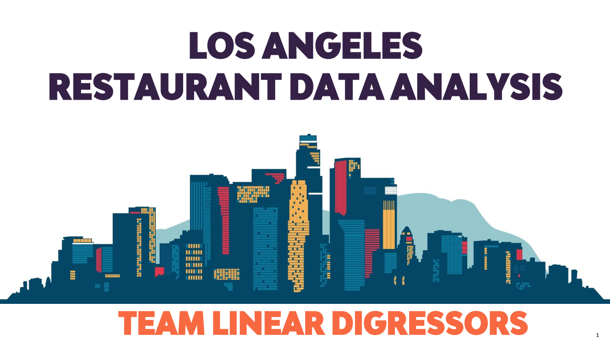
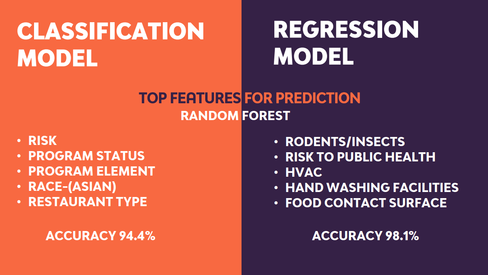
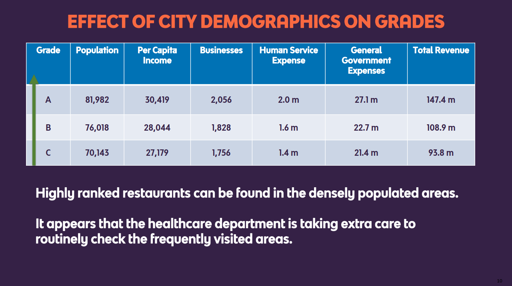
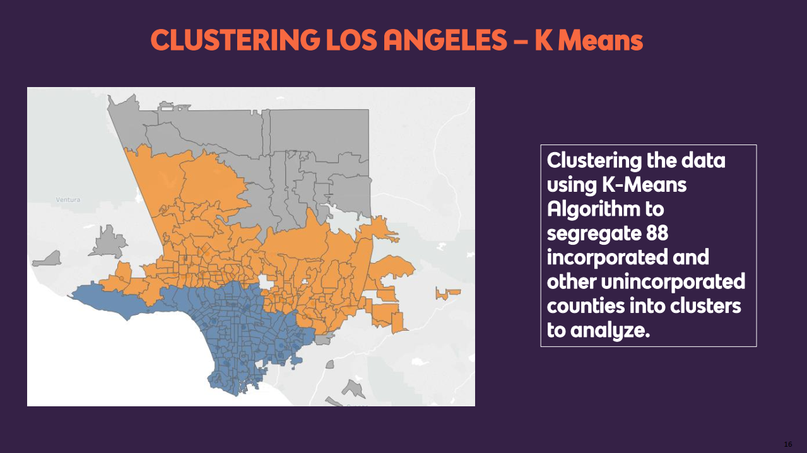

[](http://hits.dwyl.io/harshbg/Los-Angeles-Restaurant-Data-Analysis-and-Prediction)


# Los Angeles Restaurant Data Analysis and Prediction
> An analysis of the inspection data of the restaurants in the 88 cities of Los Angeles county.
The project was done as part of INFORMS Analytics Challenge at the University of Texas at Dallas. The entire summary of the project can be found in the [project report]().

## Table of contents
* [General info](#general-info)
* [Screenshots](#screenshots)
* [Technologies and Tools](#technologies-and-tools)
* [Setup](#setup)
* [Process](#process)
* [Code Examples](#code-examples)
* [Features](#features)
* [Status](#status)
* [Inspiration](#inspiration)
* [Contact](#contact)

## General info
The city of Los Angeles publishes data on Environment Health inspection and enforcement results from restaurants in the Los Angeles county. These data cover 85 of 88 cities and all
unincorporated areas in the LA county. 


## Screenshots





## Technologies and Tools
* Python
* Tableau 
* Microsoft Excel

## Setup
Describe how to install / setup your local environement / add link to demo version.

There are two datasets available: (i) market inspection dataset: contains results of inspection;
and (ii) market violations dataset: contains information on health code violations in restaurants.
These data were last updated on January 16, 2019. Data dictionaries for the above two data sets
are included below. Feel free to supplement the above information with other publicly-available
information

## Process

## Code Examples
Some examples of usage:

````

````

## Features
We have tried to answer the following questions in our analysis:

* What are the key factors in predicting health “scores” of the restaurants in Los Angeles county?
* What are the most important factors in classifying restaurants into different “grades”?
* Are there any relationships between various types of health code violations and scores/grades of a restaurant?
* Are there any patterns in terms of how health scores of restaurants change over time?

## Status
Project is: _finished_. Our team was the winner of the INFORMS Analytics Challenge 2019. Our college, [The University of Texas at Dallas](https://www.utdallas.edu/) has published an article detailing the account of the competitions win by our team "Linear Digressors" [here](http://bit.ly/2Wpq792). 

## Inspiration
Add here credits. Project inspired by..., based on...

## Contact
Created by me and my teammate [Siddharth Oza](https://github.com/siddharthoza), and [Ashish Sharma](https://github.com/ashish1993utd).

If you loved what you read here and feel like we can collaborate to produce some exciting stuff, or if you
just want to shoot a question, please feel free to connect with me on <a href="hello@gupta-harsh.com" target="_blank">email</a>, 
<a href="http://bit.ly/2uOIUeo" target="_blank">LinkedIn</a>, or 
<a href="http://bit.ly/2CZv1i5" target="_blank">Twitter</a>. 
My other projects can be found [here](http://bit.ly/2UlyFgC).

[](http://bit.ly/2HYQaL1)
[](http://bit.ly/2VHxROX)
[](http://bit.ly/2M0s0Vu)